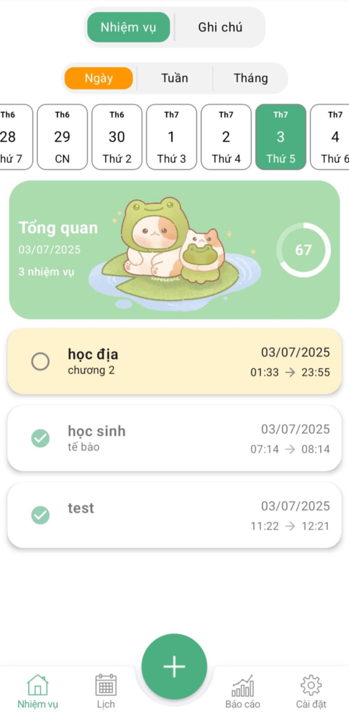
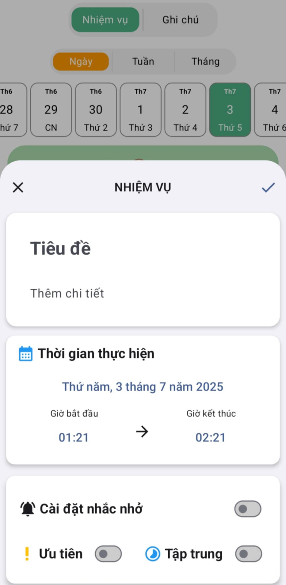
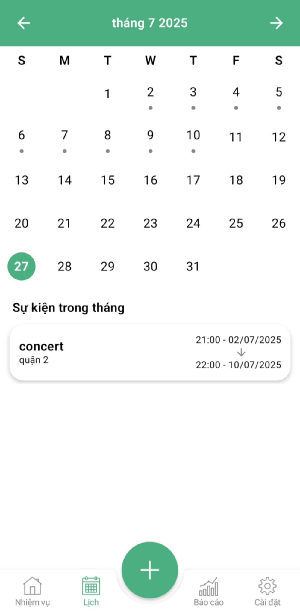
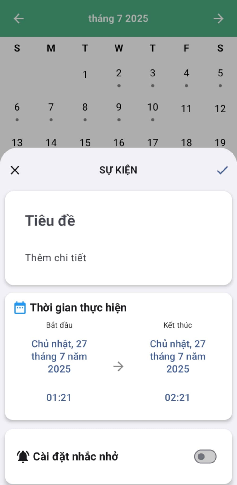
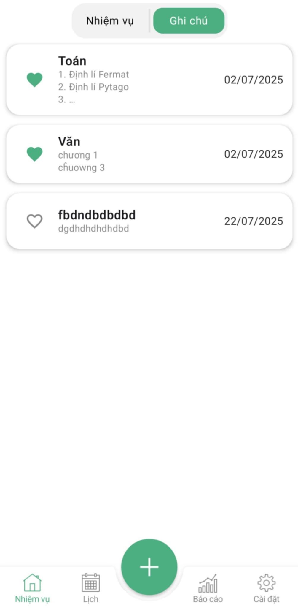
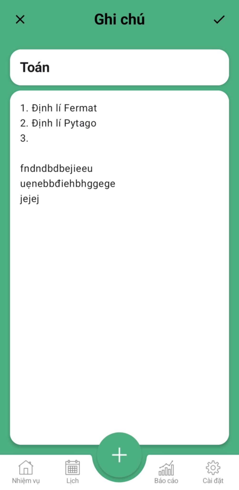
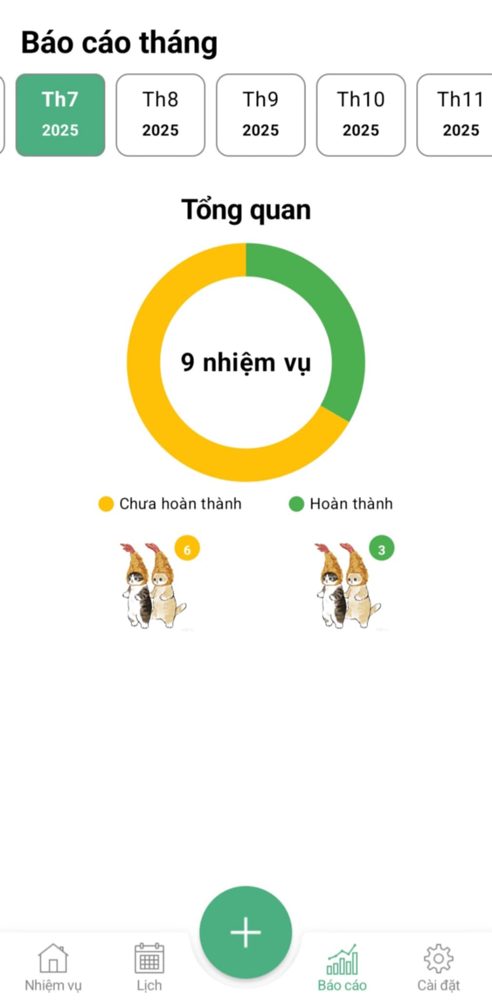
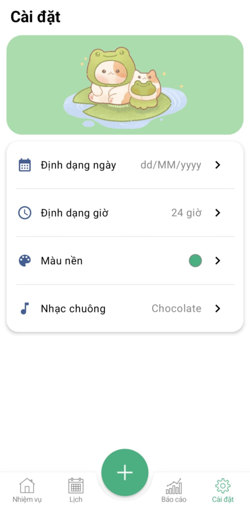
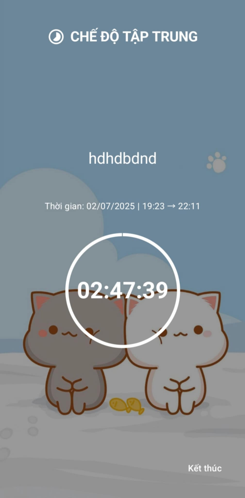

# 📅 TodoList App

A personal task management application built with **Kotlin**, using **Jetpack Compose**, **MVVM architecture**, and **Room Database**. The app allows users to create, view, and manage tasks (Todos), events,  notes, focus sessions, and monthly productivity reports.


## 📌 Features
- **Task Management**: Create, view, edit, and delete tasks with start/end times, reminders, priority, completion status, and focus mode.
- **Event Management**: Add view, edit, and delete events by calendar.
- **Note Management**: Create, edit, and delete personal notes.
- **Focus Mode**: Enable a timer to maintain focus on specific tasks.
- **Customer Management**: Tracks registered customer details (for members who can buy on credit and receive discounts).
- **Monthly Report**: Track completed and pending tasks monthly for productivity analysis.
- **User Settings**: Customize date/time formats, interface colors, and reminder tones.

---

## 🛠️ Technologies Used
- **Room Database**: Local SQLite database with Flow for real-time data.
- **Jetpack Compose**: Modern UI framework for flexible screens.
- **Hilt**: Dependency Injection for managing components.
- **Kotlin Coroutines & Flow**: Asynchronous task and data flow handling.
- **Java Time API**: Date/time management with user-defined formats.
- **Accompanist Permissions**: Handles runtime permissions (e.g., notifications).
- **RingtoneManager**: Manages custom notification sounds.
- **Material 3**: Supports Dynamic Colors and dark/light themes.

---

## 📱 Screens
<div align="center">

<table>
  <thead>
    <tr>
      <th>Screen</th>
      <th>Preview</th>
    </tr>
  </thead>
  <tbody>
    <tr>
      <td>Todo</td>
      <td></td>
    </tr>
    <tr>
      <td>Add/Edit Todo</td>
      <td></td>
    </tr>
    <tr>
      <td>Calendar</td>
      <td></td>
    </tr>
    <tr>
      <td>Add/Edit Event</td>
      <td></td>
    </tr>
    <tr>
      <td>Note</td>
      <td></td>
    </tr>
    <tr>
      <td>Add/Edit Note</td>
      <td></td>
    </tr>
    <tr>
      <td>Report</td>
      <td></td>
    </tr>
    <tr>
      <td>Setting</td>
      <td></td>
    </tr>  
    <tr>
      <td>Focus Mode</td>
      <td></td>
    </tr>  
    
  </tbody>
</table>
</div>
---
## 🚀 Getting Started

### ⚙️ Requirements
- Android Studio (latest version)

### 📦 Installation

1. Clone the repository:
```
git clone https://github.com/22520896/TodoList.git
```

2. Open project in Android Studio.

3. Sync Gradle and download dependencies.

4. Connect a device or use an emulator to run the app.
